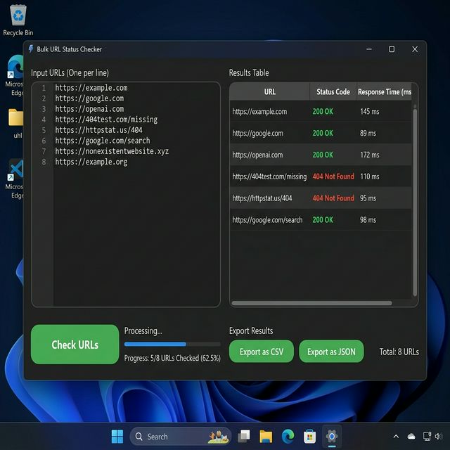

# Windows Business Automation Tool (URL Checker)

A standalone, installation-free Windows desktop application designed to perform bulk URL health checks and export the results to Excel instantly.

✔ Saves hours of manual clicking by validating thousands of URLs in seconds
✔ Requires absolutely zero technical knowledge to use—just double-click the .EXE
✔ Provides instant, actionable reports via clean Excel/CSV exports and color-coded UI

## Use Cases
- **SEO Auditing:** Allow non-technical marketing teams to instantly check thousands of backlinks for 404 errors.
- **IT Operations:** Quickly verify the uptime of internal web services and dashboards without writing custom scripts.
- **Data Cleaning:** Validate massive lists of web directories or leads before running expensive marketing campaigns.

---

## Tech Stack

- **Python + tkinter** — native cross-platform GUI
- **httpx** — HTTP client with redirect tracking, shared connection pool
- **openpyxl** — Excel import/export
- **PyInstaller** — packages everything into a single .exe

---

## Features

- **Parallel checks** (1–32 at once) with a live progress bar and a **Stop** button
- Configurable **timeout**, **retries** for flaky connections and **SSL verification**
- Clear results: `200`, `404`, `503`, `TIMEOUT`, `DNS_ERR`, `SSL_ERR`, `CONN_ERR`, `REDIRECT_LOOP`,
  plus response time, number of redirects, final URL and content type
- Color-coded rows, summary line (OK / redirect / 4xx / 5xx / timeout / error), sortable columns,
  double-click to open a URL, right-click to copy
- Input: paste URLs (one per line or comma-separated, `#` comments, missing `https://` added),
  or load **.txt / .csv / .xlsx**; duplicates and invalid lines are skipped with a notice
- Export to **Excel** (colored, filterable, with a Summary sheet) or **CSV** (opens cleanly in Excel)
- **Command-line mode** for scheduled checks (Task Scheduler / cron)

---

## Run from Source

```bash
git clone https://github.com/bck-stack/windows-business-automation-tool
cd windows-business-automation-tool
pip install -r requirements.txt
python app.py
```

### Headless / scheduled

```bash
python checker.py urls.txt -o report.xlsx --workers 16 --timeout 8
# exit code 1 when any URL is broken — easy to alert on
```

---

## Build .EXE

```bash
build.bat
# or manually:
pip install -r requirements.txt -r requirements-dev.txt
python -m PyInstaller --onefile --windowed --name URLHealthChecker app.py
# Output: dist/URLHealthChecker.exe
```

---

## Usage

1. Paste URLs into the text box, or click **Load file** to import a .txt / .csv / .xlsx list
2. Adjust **Timeout**, **Parallel** and **Retries** if needed
3. Click **Check URLs** (click **Stop** to cancel)
4. Review the color-coded results — click a column header to sort
5. Export with **Export Excel** or **Export CSV**

---

## Example Output

| URL | Status | Time (ms) | Redirects | Final URL |
|-----|--------|-----------|-----------|-----------|
| https://example.com | 200 | 142.3 | 0 | https://example.com/ |
| https://github.com/login/ | 200 | 380.5 | 1 | https://github.com/login |
| https://httpbin.org/status/404 | 404 | 310.1 | 0 | https://httpbin.org/status/404 |
| https://broken-site.xyz | DNS_ERR | — | 0 | — |

---

## Project Structure

```
├── app.py          # tkinter GUI (worker threads talk to the UI through a queue)
├── checker.py      # checking engine, file import, Excel/CSV export, CLI
├── build.bat       # one-click .exe build
├── tests/          # pytest (mocked HTTP, no network needed)
├── requirements.txt
└── requirements-dev.txt
```

## Tests

```bash
pip install -r requirements-dev.txt
pytest -q
```

---

## Screenshot



---

## License

MIT
